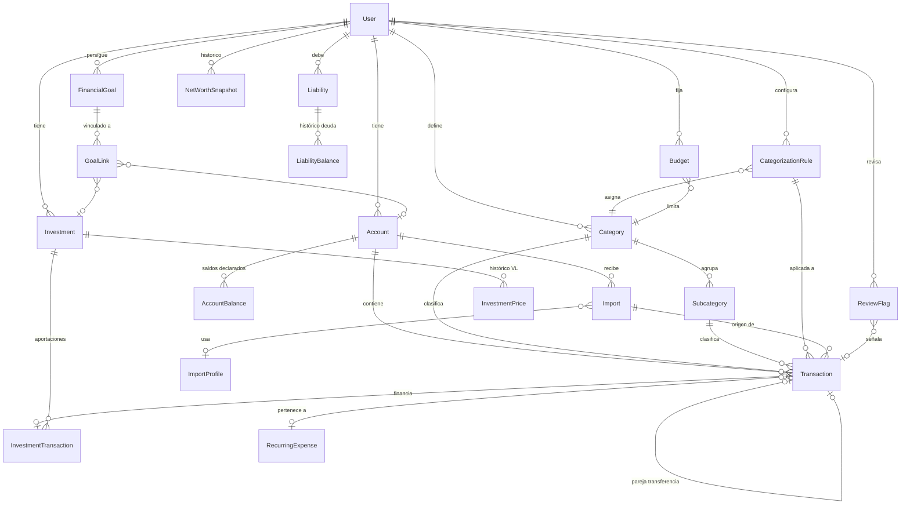

# Arquitectura — Finanzas Personales

Documento de diseño de la Fase 1. Es la referencia para todas las fases posteriores:
si una decisión cambia, se actualiza aquí.

Índice

1. [Arquitectura propuesta](#1-arquitectura-propuesta)
2. [Modelo de datos](#2-modelo-de-datos)
3. [Estructura de carpetas](#3-estructura-de-carpetas)
4. [Páginas y navegación](#4-páginas-y-navegación)
5. [Flujo de importación de extractos](#5-flujo-de-importación-de-extractos)
6. [Sistema anti-duplicados](#6-sistema-anti-duplicados)
7. [Reglas contables: ingresos, gastos, transferencias](#7-reglas-contables-ingresos-gastos-transferencias)
8. [Cálculo de inversiones](#8-cálculo-de-inversiones)
9. [Patrimonio y puente mensual](#9-patrimonio-y-puente-mensual)
10. [Categorización y aprendizaje](#10-categorización-y-aprendizaje)
11. [Seguridad, backup y datos demo](#11-seguridad-backup-y-datos-demo)
12. [Riesgos técnicos](#12-riesgos-técnicos)
13. [Orden de implementación](#13-orden-de-implementación)

---

## 1. Arquitectura propuesta

Se mantiene el stack pedido; no hay nada claramente mejor para este caso.

| Pieza | Elección | Motivo |
|---|---|---|
| Framework | **Next.js 16 (App Router)** + React 19 | Un solo proceso sirve UI y lógica de servidor; Server Components leen la BD sin API intermedia. |
| Lenguaje | **TypeScript** estricto (`noUncheckedIndexedAccess`) | Los errores de tipos en cálculos financieros se pagan caros. |
| Estilos | **Tailwind CSS 4** con tokens semánticos (`positive`, `negative`, `warning`, `info`) | Colores con significado fijo (§31). |
| BD | **SQLite** (fichero local `data/finanzas.db`) | Cero servicios externos, backup = copiar un fichero. |
| ORM | **Prisma 7** + adaptador `better-sqlite3` | Migraciones versionadas; cambiar a PostgreSQL = cambiar `provider` y el adaptador (`src/server/prisma.ts`). |
| Validación | **Zod** | Toda entrada del usuario y de ficheros se valida en el servidor. |
| Tests | **Vitest** | Tests de dominio puros + tests de integración con SQLite temporal. |

### Capas

```
┌──────────────────────────────────────────────────────────────┐
│ src/app/…            Páginas (Server Components) + Server    │
│                      Actions. Solo orquestan: sin cálculos.  │
├──────────────────────────────────────────────────────────────┤
│ src/server/…         Servicios con acceso a BD (Prisma):     │
│                      cuentas, importación, reglas, patrimonio│
│                      Siempre filtran por userId.             │
├──────────────────────────────────────────────────────────────┤
│ src/domain/…         Lógica PURA y determinista: dinero,     │
│                      fechas, hash anti-duplicados, ahorro,   │
│                      rentabilidad, TIR. Sin BD, sin red.     │
│                      → Aquí se concentran los tests.         │
└──────────────────────────────────────────────────────────────┘
```

Principio: **todo cálculo financiero vive en `src/domain`** y recibe los datos como
argumentos. Así es reproducible (mismo input → mismo output) y testeable sin BD.
Cada cálculo devuelve, además del total, **las IDs de las operaciones que lo forman**
(`TracedAmount`), que es lo que permite "pulsar un número y ver de dónde sale" (§42).

No hay API REST pública: las mutaciones son Server Actions y las descargas
(export/backup) Route Handlers. No se llama a ningún servicio externo.

### Preparado para el futuro

- **Autenticación**: todas las entidades raíz tienen `userId`; el usuario actual se
  obtiene en un único punto (`src/server/auth/current-user.ts`). Añadir Auth.js
  solo cambia esa función y añade un middleware.
- **PostgreSQL**: el esquema usa solo tipos portables (`Int`, `Decimal`, `String`,
  `DateTime`, enums). Los importes de hasta ±21 millones € caben en `Int` (céntimos).
- **APIs de mercado**: `InvestmentPrice.source = API` reservado; se añadirá un
  "PriceProvider" enchufable. **No se implementa sin tu aprobación.**
- **PDF**: el importador tiene una interfaz `StatementParser` (fase 3); CSV y
  XLSX/XLS son implementaciones, PDF será otra.

---

## 2. Modelo de datos

Esquema completo y comentado en [`prisma/schema.prisma`](../prisma/schema.prisma).

### Convenciones

| Qué | Cómo | Por qué |
|---|---|---|
| Importes | `Int` en **céntimos**, con signo (− sale, + entra) | Sin errores de coma flotante; la conciliación cuadra al céntimo. |
| Participaciones y precios | `Decimal` | Los fondos usan 4-6 decimales. |
| Fechas contables | `DateTime` a 00:00 UTC | La zona horaria nunca mueve una operación de mes. |
| Históricos | Filas nuevas por fecha; nunca `UPDATE` de valores pasados | §34. Los cambios manuales quedan en `AuditLog`. |
| Derivados | Nunca se almacenan si se pueden calcular (saldo actual, participaciones, precio medio) | Una sola fuente de verdad. Los `NetWorthSnapshot` son caché recalculable. |

### Diagrama de relaciones



### Entidades

Las 16 pedidas + 7 de apoyo (marcadas con *).

| Entidad | Propósito | Claves importantes |
|---|---|---|
| `User` | Propietario de todo. Hoy uno solo. | Sin credenciales bancarias; `passwordHash` reservado para login futuro. |
| `AppSetting`* | Clave/valor: estado del asistente inicial, preferencias. | PK `(userId, key)` |
| `Account` | Cuenta corriente, remunerada, efectivo, tarjeta, broker, inversión, otros activos. | `openingBalance` + `openingDate` = punto de partida del saldo calculado. |
| `AccountBalance`* | **Saldo declarado** (banco/usuario) con fecha. Histórico. | Conciliación: se compara con el saldo **calculado**. |
| `Transaction` | Movimiento bancario normalizado. | `descriptionRaw` inmutable; `kind`; `dedupHash` UNIQUE por cuenta; `transferPeerId` 1:1; `importId` + `importRowIndex` (trazabilidad hasta la fila del fichero). |
| `Category` / `Subcategory` | Árbol de 2 niveles. `kind` de la categoría propone el `kind` del movimiento. | Categorías de sistema (Transferencias, Inversiones, Ingresos) no borrables. |
| `CategorizationRule` | "Si descripción contiene X → categoría Y". | `priority`, `origin` (SYSTEM/USER/LEARNED), `timesApplied`. Condiciones opcionales por cuenta e importe. |
| `CategorizationCorrection`* | Cada corrección manual de categoría. | Base del aprendizaje (§10). |
| `Import` | Un fichero importado. | `fileHash` (aviso de mismo fichero), contadores nuevos/duplicados/marcados, `statementBalance` para conciliar, estado `REVERTED` para deshacer. |
| `ImportProfile`* | Formato bancario reutilizable (mapeo de columnas, formato de fecha, separador decimal…). | `headerSignature` para autodetectar el banco. |
| `Investment` | Fondo, ETF, acción, PIAS, plan de pensiones, cripto… | `valuationMode`: `UNITS` (participaciones × VL) o `TOTAL_VALUE` (valor total manual). |
| `InvestmentTransaction` | Compra/aportación, venta, dividendo, comisión. **Fuente de verdad de lo aportado.** | `cashTransactionId` enlaza con el cargo bancario. |
| `InvestmentPrice` | Histórico de VL / valor total. | UNIQUE `(investmentId, date)`: un valor por día; los anteriores se conservan. |
| `Liability` + `LiabilityBalance`* | Préstamos, hipoteca, financiación, deudas. Saldo pendiente histórico. | |
| `Budget` | Límite mensual por categoría/subcategoría. | `validFrom`/`validTo` ("YYYY-MM"): cambiar un presupuesto no reescribe meses pasados. |
| `FinancialGoal` + `GoalLink`* | Objetivo con importe y fecha. Progreso = cuentas/inversiones vinculadas o manual. | |
| `NetWorthSnapshot` | Foto de patrimonio a fin de mes. **Caché recalculable**, con `incomplete` si falta algún dato y `isClosed` para congelar meses. | |
| `RecurringExpense` | Gasto recurrente detectado/confirmado. | `merchantKey`, frecuencia, importe típico; estado DETECTED/CONFIRMED/DISMISSED. |
| `ReviewFlag` | Incidencias de calidad del dato: posible duplicado, posible transferencia, descuadre de saldo, inversión sin actualizar, operación dudosa. | Estado OPEN/RESOLVED/DISMISSED; nunca se borra. |
| `AuditLog`* | Antes/después de cada edición o borrado de datos financieros. | Permite rastrear y deshacer errores. |

**¿Por qué no hay tabla de posiciones de inversión?** Participaciones, precio medio y
capital aportado se derivan de `InvestmentTransaction`. Guardarlos duplicados crearía
dos fuentes de verdad que pueden divergir.

**¿Y "otros activos" (vivienda, coche)?** Son `Account` de tipo `OTHER` valoradas con
`AccountBalance` manuales. Mismo mecanismo de histórico, sin tabla extra.

**Tarjetas de crédito**: `Account` tipo `CARD`; su saldo negativo cuenta como pasivo en el
patrimonio. Los préstamos con cuadro de amortización van en `Liability`.

---

## 3. Estructura de carpetas

```
.
├── docs/ARQUITECTURA.md       este documento
├── prisma/
│   ├── schema.prisma          modelo de datos (fuente de verdad)
│   ├── migrations/            migraciones SQL versionadas
│   ├── seed.ts / seed-lib.ts  seed idempotente (usuario, categorías, reglas)
│   └── seed-data/             categorías y reglas iniciales editables
├── scripts/
│   ├── demo.ts                crear / arrancar / borrar la BD demo
│   └── demo-data.ts           datos ficticios
├── src/
│   ├── app/                   rutas (una carpeta por página del menú)
│   ├── components/
│   │   ├── layout/            menú lateral, menú móvil, banner demo
│   │   └── ui/                piezas reutilizables (Card, PendingData…)
│   ├── domain/                LÓGICA PURA: money, dates, text, dedup, cashflow,
│   │                          (fase 6) investments, (fase 7) networth…
│   ├── server/
│   │   ├── config.ts          entorno y salvaguardas del modo demo
│   │   ├── prisma.ts / db.ts  cliente de BD
│   │   ├── auth/              usuario actual (punto único)
│   │   ├── import/            (fase 3) parsers CSV/XLSX + pipeline
│   │   └── services/          (fase 2+) cuentas, movimientos, reglas…
│   ├── lib/                   utilidades de UI (navegación)
│   └── generated/prisma/      cliente Prisma generado (no versionado)
├── tests/
│   ├── domain/                tests de cálculo puro
│   ├── db/                    tests de integración (SQLite temporal)
│   ├── fixtures/              (fase 3) extractos bancarios de ejemplo
│   └── helpers/
└── data/                      BD local y backups (NO versionado)
```

---

## 4. Páginas y navegación

Menú lateral en escritorio; cabecera con menú desplegable en móvil.

| Ruta | Página | Contenido principal | Fase |
|---|---|---|---|
| `/` | Dashboard | KPIs (patrimonio neto, liquidez, inversiones, ahorro del mes) + distribución + alertas | 5 |
| `/movimientos` | Movimientos | Tabla filtrable (fecha, mes, año, cuenta, categoría, importe, texto), edición, vincular transferencias. Acepta filtros por URL para "ver las operaciones de este número". | 2 |
| `/cuentas` | Cuentas | Cuentas + saldo calculado vs. declarado; pasivos | 2 |
| `/inversiones` | Inversiones | Resumen, detalle por inversión, aportaciones, VL, rentabilidad, distribución | 6 |
| `/patrimonio` | Patrimonio | Evolución mensual, activos − pasivos, puente mensual | 7 |
| `/presupuestos` | Presupuestos | Gastado / presupuesto por categoría | 8 |
| `/analisis` | Análisis | Mes actual, comparaciones, recurrentes, ingresos, alertas | 9 |
| `/objetivos` | Objetivos | Progreso de metas | 8 |
| `/importar` | Importar | Asistente de importación (§5) | 3 |
| `/revision` | Revisión | Cola de calidad del dato | 10 (parcial desde 3) |
| `/configuracion` | Configuración | Categorías, reglas, perfiles de banco, backup, borrar demo | 4 / 10 |

**Trazabilidad en la UI**: todo número importante es un enlace a `/movimientos?…`
con los filtros que lo generan (p.ej. `?mes=2026-09&tipo=EXPENSE`), o a un panel
lateral con el desglose. Los números sin datos suficientes muestran
**"Pendiente de datos"** (componente `PendingData`), nunca 0 ni una estimación.

**Asistente de primera ejecución** (fase 2): si no hay cuentas, el dashboard muestra
los pasos 1-6 (§35); el progreso se guarda en `AppSetting`.

---

## 5. Flujo de importación de extractos

```
 Subir fichero ─► Leer ─► Detectar cabecera ─► Mapear columnas ─► Normalizar
  (CSV/XLS/XLSX)   │        (fila de títulos)     (con perfil       │
                   │                              guardado si       ▼
                   │                              coincide)     Validar filas
                   ▼                                               │
          sha256 del fichero:                                      ▼
          "Este fichero ya se importó                     Hash anti-duplicados
           el 12/09 (Import #…)"                          + clasificación
                                                                   │
                                                                   ▼
                                    ┌─────────────── VISTA PREVIA ─────────────┐
                                    │ Se han detectado 184 operaciones.        │
                                    │ 178 nuevas · 6 ya existían · 2 dudosas   │
                                    │ 3 filas no válidas (motivo por fila)     │
                                    │ Categoría propuesta por reglas           │
                                    │ Posibles transferencias internas         │
                                    │ Saldo extracto vs. saldo calculado       │
                                    └──────────────────────────────────────────┘
                                                   │ confirmar
                                                   ▼
                          Transacción de BD única (todo o nada):
                          Import + Transactions + AccountBalance + ReviewFlags
                                                   │
                                                   ▼
                          Resumen final + enlace a Revisión. "Deshacer
                          importación" disponible (borra solo sus movimientos).
```

Detalles:

1. **Lectura** (`src/server/import/parsers`): el tipo se decide por el
   CONTENIDO, no por la extensión. CSV con detección de codificación (UTF-8; si
   no es válido, Windows-1252 — habitual en bancos españoles) y de delimitador
   (`;` `,` tab `|`) con PapaParse. XLSX con `read-excel-file`. XLS binario
   antiguo: rechazado con instrucciones (ver riesgos). Una interfaz
   `StatementParser { canParse(bytes); parse(bytes): RawTable }` permite añadir
   PDF u otros formatos sin tocar el resto. El fichero original se guarda en
   `Import.fileData` para poder reanalizarlo y rastrear cada movimiento hasta
   su fila (`importRowIndex`).
2. **Cabecera**: muchos bancos ponen títulos/IBAN antes de la tabla. Se elige la
   primera fila con ≥ 3 celdas de texto que contenga palabras clave (fecha,
   concepto, importe, saldo…). El usuario puede corregirla.
3. **Mapeo**: `Fecha`, `Fecha valor`, `Descripción`, `Importe` **o** `Cargo`+`Abono`,
   `Saldo`, `Categoría del banco` (opcional). Formato de fecha y separador
   decimal se **detectan una vez por fichero** (no fila a fila) y se muestran para
   confirmar; si la fecha es ambigua (DD/MM vs MM/DD) se pide confirmación.
   El mapeo se guarda como `ImportProfile` y se reutiliza automáticamente cuando
   la cabecera coincide.
4. **Normalización**: `descriptionRaw` (intacta), `descriptionClean`,
   `merchant` (clave de comercio), importe en céntimos, `kind` provisional según
   signo, categoría por reglas.
5. **Validación por fila**: fecha inválida, importe no numérico, fecha futura,
   fila de totales… → la fila se muestra como "no válida" con el motivo; nunca se
   descarta en silencio.
6. **Conciliación** (§27): si el extracto trae saldo, el último saldo se guarda
   como `AccountBalance` (source `IMPORT`) y se compara con el saldo calculado.
   Si hay columna de saldo en cada fila, se puede localizar **la primera fila
   donde diverge** el saldo acumulado → origen de la diferencia.
7. **Coherencia interna del extracto**: si hay columna de saldo, se comprueba
   `saldo[i] = saldo[i-1] + importe[i]`. Detecta separador decimal o columnas mal
   asignadas, y si solo cuadra invirtiendo signos, lo sugiere (tarjetas).
8. **Saldo inicial desde el extracto**: si la cuenta se creó con el saldo de hoy
   y el extracto es anterior, se ofrece (nunca se aplica solo) ajustar el saldo
   inicial al deducido del extracto. Deshacer la importación lo restaura.
9. **Confirmación atómica**: todo en una transacción de BD, recalculando la
   vista previa dentro de ella. Si algo falla, no se guarda nada.
10. **Deshacer**: borra solo los movimientos de esa importación, sus saldos y
   avisos; desvincula transferencias con movimientos de otras importaciones.

---

## 6. Sistema anti-duplicados

Implementado en [`src/domain/dedup.ts`](../src/domain/dedup.ts) (con tests).

**Nivel 0 — Mismo fichero.** `sha256` del fichero. Si ya se importó, aviso claro
antes de continuar (no bloquea: el nivel 1 hará que todo salga como "ya existía").

**Nivel 1 — Duplicado exacto (descartado).**

```
dedupHash = sha256( v1 | cuenta | fecha | importe | descripción normalizada | ocurrencia )
UNIQUE (accountId, dedupHash)   ← garantía en la propia base de datos
```

- *Descripción normalizada*: mayúsculas, sin acentos, espacios colapsados. Nada más
  agresivo, para no fusionar operaciones distintas.
- *Ocurrencia*: resuelve dos operaciones idénticas legítimas el mismo día (dos cafés
  de 1,50 €). Dentro de cada fichero, la 1ª es ocurrencia 0, la 2ª ocurrencia 1.
  Al reimportar el mismo extracto o uno solapado, los hashes coinciden.
  Si el primer extracto traía un café y el segundo trae dos, el segundo café
  entra como nuevo (ocurrencia 1). Probado en `tests/domain/dedup.test.ts`.
- Aunque el código de la aplicación fallase, la restricción `UNIQUE` impide
  físicamente insertar el duplicado.

**Nivel 2 — Duplicado probable (se inserta marcado, nunca en silencio).**
Mismo importe, misma cuenta, fecha a ±3 días y descripción parecida (Jaccard ≥ 0,5),
pero hash distinto (el banco cambió el texto o usó fecha valor). En la vista previa
aparece como "dudosa" y el usuario decide: importar (se crea `ReviewFlag
POSSIBLE_DUPLICATE` vinculado a ambas) o descartar.

**Movimientos manuales**: mismo hash; si colisiona con uno existente se avisa.

**Versión del hash**: `v1` va dentro del hash. Si algún día cambia la
normalización, se sube la versión y se migra con un script, nunca en silencio.

---

## 7. Reglas contables: ingresos, gastos, transferencias

Implementado en [`src/domain/cashflow.ts`](../src/domain/cashflow.ts) (con tests).

| `kind` | Ingresos | Gastos | Ahorro | Se muestra como |
|---|---|---|---|---|
| `INCOME` | ✔ | | ✔ | Ingreso |
| `EXPENSE` (importe −) | | ✔ | ✔ | Gasto |
| `EXPENSE` (importe +) | | resta | ✔ | Reembolso de una compra |
| `TRANSFER` | ✘ | ✘ | ✘ | Transferencia interna (trazable) |
| `INVESTMENT` | ✘ | ✘ | — | "Aportado a inversión" |
| `ADJUSTMENT` | ✘ | ✘ | ✘ | Ajuste de conciliación |

- **Ahorro** = ingresos − gastos. **Tasa de ahorro** = ahorro / ingresos × 100;
  si no hay ingresos, "Pendiente de datos".
- La aportación a un fondo **no es gasto**: sale de la liquidez y entra en
  inversión; el patrimonio no cambia por ella.

**Transferencias internas** (§11): al importar, se buscan parejas en **otra cuenta
propia** con importe opuesto exacto y fecha a ±3 días.
- Una sola candidata y descripción con "TRASPASO/TRANSFERENCIA/…" → se enlazan
  (`transferPeerId` en ambos lados, `kind = TRANSFER`).
- Varias candidatas o señal débil → `ReviewFlag POSSIBLE_TRANSFER` para que decidas.
- Si la otra cuenta aún no tiene extracto, el movimiento queda como transferencia
  "sin pareja" y se emparejará cuando se importe la otra cuenta.
- Si la pareja es una cuenta de broker, se puede además registrar como
  `INVESTMENT` enlazado a una `InvestmentTransaction`.

---

## 8. Cálculo de inversiones

Todo en [`src/domain/investments.ts`](../src/domain/investments.ts), puro y testeado (`tests/domain/investments.test.ts`, `tests/db/investments.test.ts`).

**Entradas**: `InvestmentTransaction[]` (BUY/SELL/DIVIDEND/FEE) + `InvestmentPrice[]`.

**Posición** (método de **coste medio ponderado**, el habitual para mostrar el
"precio medio". Ojo: a efectos fiscales Hacienda aplica FIFO en ventas de fondos y
acciones; el cálculo fiscal queda fuera de la v1 y, si se añade, será un método
aparte, nunca mezclado con este):

```
participaciones   = Σ unidades compradas − Σ unidades vendidas
capital aportado  = Σ (importe BUY + comisiones BUY)          ← lo que TÚ has puesto
retirado          = Σ importe neto SELL + Σ DIVIDEND
coste posición    = coste medio × participaciones vivas
precio medio      = coste posición / participaciones
valor actual      = participaciones × último VL   (modo UNITS)
                  = último valor total introducido (modo TOTAL_VALUE)
```

**Rentabilidad — separando aportaciones de rendimiento (§15):**

```
ganancia total        = valor actual + retirado − capital aportado
rentabilidad simple   = ganancia total / capital aportado × 100
ganancia no realizada = valor actual − coste posición
ganancia realizada    = Σ (venta − coste medio de lo vendido) + dividendos − comisiones sueltas
```

Ejemplo del enunciado: aportado 10.000 €, valor 11.250 € → ganancia 1.250 €, +12,5 %.
Una nueva aportación de 300 € sube el valor y el capital aportado a la vez: la
ganancia no cambia.

**Rentabilidad ponderada por aportaciones** = **TIR / XIRR** (money-weighted
return): la tasa anual *r* tal que Σ flujo_i / (1+r)^(días_i/365) = 0, con
aportaciones negativas, retiradas positivas y valor actual como flujo final.
Se resuelve con Newton-Raphson con respaldo de bisección (siempre converge o
devuelve "no calculable"). Para periodos < 1 año se muestra también sin anualizar,
porque una TIR anualizada de 3 semanas es engañosa.

**Rentabilidad temporal (TWR)**: solo "cuando es posible", es decir, si hay VL en
la fecha de cada aportación. Si falta alguno → "Pendiente de datos".

**Datos que faltan**: sin ningún VL → valor actual "Pendiente de datos" (nunca se
asume el precio de compra). VL con más de N días (configurable, 35 por defecto) →
`ReviewFlag STALE_INVESTMENT` y aviso junto a la cifra.

**Implementación (fase 6) — decisiones concretas**:
- Participaciones y precios con `decimal.js` (exactos); importes en céntimos.
- Una compra se registra con importe + participaciones o precio (el tercero se
  deduce; si vienen los tres y no cuadran, error).
- Valoración = último VL registrado **o** precio de la última compra/venta, el
  más reciente de los dos (ambos son datos reales de mercado). Modo
  `TOTAL_VALUE` (PIAS, planes): solo el último valor total introducido.
- Comisiones sueltas (`FEE`) cuentan como capital aportado (dinero que pones y
  no compra valor) → reducen la ganancia. Los dividendos cuentan como retirado.
- Vincular una operación con su cargo/abono bancario (importe exacto) marca ese
  movimiento como `INVESTMENT`: deja de contar como gasto/ingreso y queda la
  traza banco ↔ fondo. Borrar la operación lo desvincula.
- No se puede registrar una venta de más participaciones de las que hay.
- TIR con menos de un año de historia: se muestra atenuada con aviso «<1a».
- Inversiones sin valoración de más de 35 días: aviso en Cartera, Dashboard y Revisión (calculado, no persistido).
- Evolución mensual: si en un mes alguna inversión no tiene valoración, el valor
  de la cartera ese mes queda pendiente (hueco en el gráfico), nunca estimado.
- Cuentas de tipo «Inversión (valor manual)» e inversiones detalladas se suman
  ambas al patrimonio: usa una u otra para los mismos activos, no las dos.

**Valor en una fecha pasada** (para patrimonio histórico): participaciones a esa
fecha × último VL **en o antes** de esa fecha. Si no hay VL anterior → pendiente.

---

## 9. Patrimonio y puente mensual

```
Patrimonio neto = Activos − Pasivos
Activos  = saldos de cuentas (CHECKING, SAVINGS, CASH, BROKER, INVESTMENT, OTHER si > 0)
         + valor de mercado de inversiones
Pasivos  = saldos pendientes de Liability + tarjetas con saldo negativo
```

Saldo de una cuenta a una fecha = `openingBalance` + Σ movimientos entre
`openingDate` y esa fecha. Si el usuario solo registra saldos manuales (p.ej. una
cuenta sin extractos), se usa el último `AccountBalance` declarado.

**Implementación (fase 5)**: [`src/domain/networth.ts`](../src/domain/networth.ts)
(puro) y `src/server/services/networth.ts` (`netWorthAt(fecha)`), siempre desde
los datos de origen. Reglas:
- Una cuenta cuyo saldo inicial es **posterior** a la fecha consultada no tiene
  valor conocido → el total queda **incompleto** y se dice qué falta; nunca 0.
- Un saldo negativo (tarjeta, descubierto) cuenta como **deuda**, no como activo negativo.
- Cuentas en otra moneda: excluidas y listadas como pendientes (sin tipo de cambio).
- Cuentas archivadas: excluidas (cerradas). Deudas: último saldo registrado en
  o antes de la fecha; sin saldo → pendiente (salvo que empiece después).
- Las variaciones («+X € este mes», «+Y % último año») solo se calculan si las
  dos fotos están completas.

**Puente mensual (§17)** — explica *por qué* cambió el patrimonio:

```
  Patrimonio inicio de mes
+ Ingresos
− Gastos
+ Rentabilidad de inversiones  (Δ valor − aportaciones netas del mes)
+ Revalorización de otros activos / variación de deudas no explicada por pagos
+ Diferencia no explicada      ← se MUESTRA, nunca se oculta (descuadres, datos pendientes)
= Patrimonio fin de mes
```

La "diferencia no explicada" es la red de seguridad: si es distinta de 0, algo falta
o está mal (movimientos sin importar, saldo inicial erróneo) y enlaza a Revisión.

`NetWorthSnapshot` guarda la foto de cada fin de mes como caché. Si se editan
datos de un mes cerrado, se recalcula y se muestra la diferencia respecto a la
foto cerrada en lugar de reescribirla en silencio.

---

## 10. Categorización y aprendizaje

Motor puro en [`src/domain/rules.ts`](../src/domain/rules.ts); servicio en
`src/server/services/rules.ts`.

**Coincidencia**. Las reglas comparan contra:
- `DESCRIPTION`: la descripción del banco normalizada (mayúsculas, sin acentos).
  `CONTAINS` busca **palabras completas** («DIA» no coincide con «MEDIA»).
- `MERCHANT`: la **clave de comercio** calculada de la descripción
  (`merchantKey`: sin prefijos de tarjeta, números ni palabras vacías;
  «COMPRA TARJ. 1234XXXX BAR LA ESQUINA 12» → «BAR ESQUINA»).
Una categoría de ingresos nunca se aplica a una salida de dinero.

**Precedencia** (primera que coincide): reglas del usuario (`USER`, `LEARNED`) >
prioridad > patrón más largo > reglas del sistema. Sin coincidencia → sin
categoría → aparece en Revisión.

**Cuándo se aplican**: al importar (vista previa), al crear un movimiento
manual sin categoría ni tipo, y bajo demanda («Aplicar a los sin categoría» o
«Recalcular todos los automáticos»). **Nunca** se re-categoriza un movimiento
con `categorizationSource = MANUAL` ni una transferencia vinculada. Borrar una
regla no descategoriza nada hasta que se recalcula.

**Aprendizaje** ([`src/domain/learning.ts`](../src/domain/learning.ts)): cada
corrección manual guarda `CategorizationCorrection (merchantKey → categoría)`.
Con **3 correcciones** iguales, sin una regla del usuario que ya lo resuelva, se
sugiere «Has clasificado X como Y 3 veces. ¿Crear regla?» en el propio
movimiento y en Configuración › Reglas. Si hay correcciones contradictorias,
gana la categoría más repetida. Aceptar crea una regla `LEARNED`
(`MERCHANT` = clave) y la aplica a los sin categoría; rechazar marca las
correcciones como descartadas y no se vuelve a sugerir.

**Transferencias internas** ([`decideTransfers`](../src/domain/transfers.ts)):
tras cada importación se buscan parejas (otra cuenta propia, importe opuesto
exacto, ±5 días). Se vinculan solas **solo** si la pareja es única, mutua y
alguna descripción contiene una palabra clave (TRASPASO, TRANSFERENCIA,
LIQUIDACION TARJETA, RETIRADA CAJERO…). En el resto de casos se crea un aviso
`POSSIBLE_TRANSFER` en Revisión. Al vincular a mano, el aviso se resuelve solo.

## 11. Seguridad, backup y datos demo

- **Todo local**: la BD es `data/finanzas.db`. No hay peticiones de red salvo las
  que tú inicies. No se guardan credenciales bancarias en ningún modelo.
- `data/`, `*.db`, `backups/` y `.env` están en `.gitignore`: tus datos nunca
  acaban en el repositorio.
- **Servidor solo en local**: `next dev`/`next start` escuchan en tu máquina. Antes
  de desplegar en un servidor será obligatorio añadir autenticación (preparado, §1).
- **Backup (fase 10)**: dos formatos:
  1. **Fichero SQLite** completo (`VACUUM INTO` → copia consistente aunque la app
     esté abierta). Restaurar = reemplazar el fichero (con copia previa automática).
  2. **JSON versionado** de todas las tablas: portable a PostgreSQL y legible.
  La restauración valida versión y esquema antes de tocar nada y crea una copia
  de seguridad automática del estado actual.
- **Datos demo** (§40): viven en **otra base de datos** (`data/demo.db`), nunca en
  la real. `npm run demo:dev` arranca con banner naranja "MODO DEMO";
  `npm run demo:delete` borra el fichero. `APP_MODE=demo` rechaza cualquier BD
  cuyo nombre no contenga "demo" (salvaguarda en `src/server/config.ts`).

---

## 12. Riesgos técnicos

| Riesgo | Impacto | Mitigación |
|---|---|---|
| Formatos bancarios heterogéneos (títulos antes de la cabecera, `Cargo`/`Abono` separados, signo al final, fechas DD/MM vs MM/DD, codificación Windows-1252) | Importes o fechas mal leídos | Detección por fichero + confirmación en vista previa; perfiles por banco; parser de importes estricto con tests; fixtures reales anonimizados. |
| El banco cambia el texto de una operación entre descargas | Duplicado no detectado por hash | Nivel 2 (duplicado probable) + conciliación de saldo que revela el descuadre. |
| Operaciones pendientes que luego cambian de importe/fecha al liquidarse (tarjetas) | Duplicado o importe erróneo | Recomendación: importar solo operaciones liquidadas; nivel 2 las detecta. |
| Extractos XLS antiguos (formato BIFF) | No legibles | **Decisión (fase 3): no se admiten.** La única librería que los lee (SheetJS de npm) tiene avisos de seguridad. Se detectan por contenido y se pide guardarlos como XLSX/CSV. Los «.xls» que en realidad son CSV se leen; los que son HTML se rechazan con instrucciones. |
| Coma flotante en importes | Descuadres de céntimos | Céntimos enteros en todo el sistema; `Decimal` para participaciones. |
| Zonas horarias | Operación en el mes equivocado | Fechas a 00:00 UTC; nunca `new Date()` local para fechas contables. |
| Transferencias mal emparejadas | Ingresos/gastos inflados o perdidos | Emparejamiento automático solo con candidata única; el resto a revisión. |
| Inversiones sin VL reciente | Patrimonio desactualizado presentado como actual | Fecha del VL junto a cada valor; flag `STALE_INVESTMENT`; "Pendiente de datos". |
| Rentabilidad engañosa (TIR anualizada de periodos cortos, aportaciones contadas como ganancia) | Decisiones erróneas | Fórmulas explícitas (§8) con tests; mostrar periodo y método. |
| Moneda distinta de EUR | Sumas incorrectas | V1: todo en EUR; cuentas/inversiones en otra moneda se permiten pero se marcan y NO se suman hasta tener tipo de cambio (pendiente de datos). |
| SQLite y concurrencia | Bloqueos | Uso monousuario; WAL si hiciera falta. PostgreSQL al desplegar. |
| Corrupción/pérdida del fichero | Pérdida de datos | Backups (fase 10) + recordatorio si el último backup es antiguo. |
| Cuotas de préstamos: una parte es amortización (reduce deuda, no es gasto) y otra intereses (gasto) | Gasto sobrestimado | Fase 7: al vincular una cuota con una `Liability`, separar intereses y amortización. Hasta entonces, la cuota se categoriza como el usuario decida. |
| Dependencia de desarrollo `prisma` CLI arrastra `mysql2` con avisos de seguridad | Ninguno en ejecución (no se usa MySQL; solo en la CLI de desarrollo) | Actualizar cuando Prisma publique el parche. |

---

### Decisiones confirmadas (fase 2)

- Otros activos (vivienda, coche) = `Account` tipo `OTHER` con valoraciones manuales.
- Reembolsos de compras = `EXPENSE` con importe positivo (restan gasto); devoluciones de Hacienda = `INCOME` / Devolución.
- Aportaciones a inversión: ni gasto ni reducción del ahorro; se muestran aparte.
- El saldo inicial de una cuenta es el saldo al **final** del día indicado: los movimientos de ese día o anteriores no se vuelven a sumar.
- Los movimientos importados no permiten cambiar fecha, importe ni descripción original (reflejan el extracto); los manuales sí, recalculando su hash.
- Un duplicado exacto en el alta manual exige marcar explícitamente «es otra operación distinta».

## 13. Orden de implementación

| Fase | Contenido | Criterio de "terminado" |
|---|---|---|
| **1** ✅ | Arquitectura, esquema, migración inicial, seed de categorías/reglas, dominio base (dinero, fechas, texto, hash anti-duplicados, ahorro), layout y navegación, modo demo aislado, README | Tests de dominio y de integridad de BD en verde; build OK |
| **2** ✅ | Cuentas (CRUD, saldo inicial, saldos declarados, pasivos), movimientos (tabla, filtros, edición con AuditLog, alta manual, vincular transferencias), asistente inicial, datos demo | Saldo calculado correcto; editar deja traza |
| **3** ✅ | Importación CSV/XLSX: parsers, cabecera, mapeo, perfiles, vista previa, anti-duplicados, conciliación, deshacer importación | Reimportar el mismo extracto = 0 nuevas; fixtures de varios bancos |
| **4** ✅ | Motor de reglas, gestión de categorías/reglas, aprendizaje por correcciones, detección de transferencias | Sugerencia tras 3 correcciones |
| **5** ✅ | Dashboard con KPIs trazables (clic → operaciones) | Cada KPI enlaza a sus movimientos |
| **6** ✅ | Inversiones: aportaciones, VL, posición, rentabilidad simple, TIR, dashboard de inversiones | Tests de aportaciones vs. rentabilidad |
| **7** | Patrimonio: activos − pasivos, histórico mensual, snapshots, puente mensual | Puente cuadra o muestra la diferencia |
| **8** | Presupuestos y objetivos | |
| **9** | Análisis mensual, comparaciones, recurrentes, ingresos recurrentes vs. extraordinarios, alertas | |
| **10** | Backup/restauración, exportación CSV/XLSX, pantalla de revisión completa | Restaurar un backup reproduce exactamente los mismos totales |

No se avanza de fase si la anterior no pasa sus tests.
